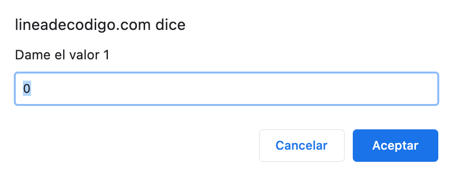

Me encuentro estos días [preparando un sencillo manual de Javascript que en breve encontrareis en Manual Web](https://www.manualweb.net/javascript/) y al cual quiero ir acompañando con ejemplos sencillos sobre [Javascript](https://www.manualweb.net/javascript/). Es por ello que iré publicando por aquí algunas cosas que a algunos os parecerán demasiado básicas y a otros os servirán para iniciaros en el mundo de la programación en [Javascript](https://www.manualweb.net/javascript/). Así, que se lean al gusto del consumidor. En este caso vamos a empezar con algo sencillo que será el saber cómo pedir datos con prompt al usuario en [Javascript](https://www.manualweb.net/javascript/). Es decir, si estoy haciendo una página web cómo puedo pedirle un dato al usuario.


Es verdad que posiblemente la mejor forma sea la de insertar un formulario con los campos para que el usuario nos pueda insertar su respuesta. Pero es verdad que de forma didáctica es sencillo el utilizar una ventana emergente o prompt en la cual el usuario nos pueda insertar un dato.


Para poder implementar el ejemplo de cómo pedir datos con prompt vamos a realizar un ejemplo que le pida al usuario dos números y que nos devuelva el resultado por consola. Lo primero es conocer la sintaxis del método [`.prompt()`](https://www.w3api.com/DOM/Window/prompt/).


```javascript
result = window.prompt(message, default);
```


Vemos que en el primer campo ponemos un mensaje a mostrar al usuario para solicitarle la información y que el segundo parámetro es el valor por defecto que le queremos dar al usuario. Es importante entender que **este valor es el valor que le aparecerá en el cuadro de dialogo y que si el usuario lo borra no se asignará como valor por defecto**. Vemos que el resultado de invocar al método [`.prompt()`](https://www.w3api.com/DOM/Window/prompt/) es asignado a una variable.


De esta forma si queremos pedir un par de números al usuario tendremos lo siguiente.


```javascript
let valor1 = prompt("Dame el valor 1",0);
let valor2 = prompt("Dame el valor 2",0);
```


Lo que hará que en nuestro [navegador web](https://www.ayudaenlaweb.com/navegadores/) se muestre algo parecido a lo siguiente:





Parece algo sencillo y que no nos lleva más allá. Pero hay que tener en cuenta un par de consideraciones. La primera es que el contenido que nos devuelve el método [`.prompt()`](https://www.w3api.com/DOM/Window/prompt/) es una cadena de texto. Lo puedes comprobar haciendo un [`.typeof()`](https://www.manualweb.net/javascript/otros-operadores-javascript/#operador-typeof) sobre su resultado.


```javascript
console.log("El contenido de un prompt es del tipo: " + typeof(valor1));
```


Es por ello que si queremos sumar los valores como si fuesen números deberemos de convertirlos a enteros con el método [`.parseInt()`](https://www.w3api.com/Javascript/parseInt/).


```javascript
let suma = parseInt(valor1) + parseInt(valor2);
```


Hay una segunda consideración. Y es que, aunque hemos visto que el segundo parámetro del método [`.prompt()`](https://www.w3api.com/DOM/Window/prompt/) nos permite dar un valor por defecto, el usuario puede borrarlo y dejar el contenido como vacío. Así que será bueno realizar algún control adicional de su contenido, sobre todo si esperamos que sea un número y queremos sumarlos.


Así podríamos tener algo así:


```javascript
valor1 = (valor1=="")?"0":valor1;
valor2 = (valor2=="")?"0":valor2;
```


Con esto ya habremos aprendido todo lo que teníamos que saber sobre como pedir datos con prompt en [Javascript](https://www.manualweb.net/javascript/).

