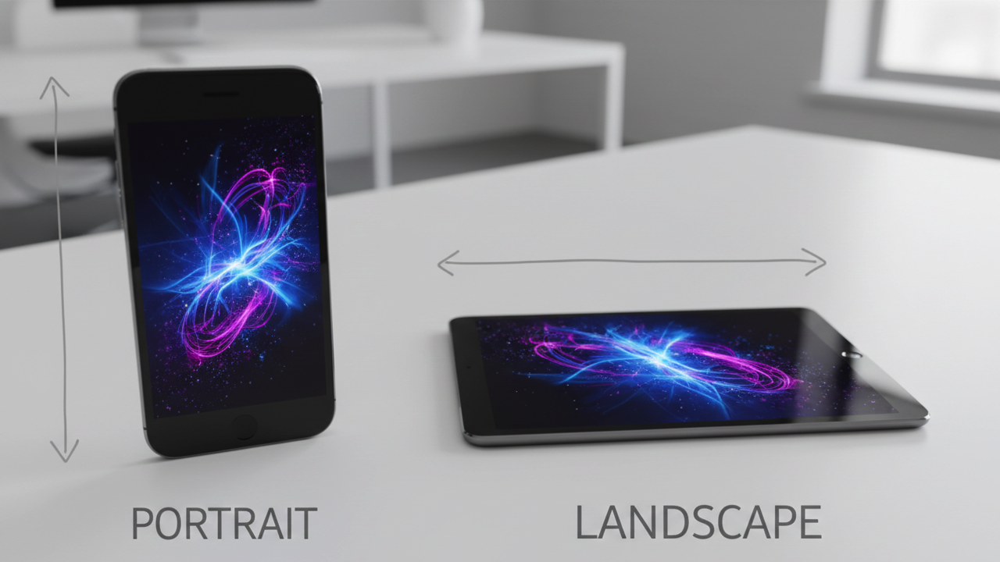

Una de las capacidades de los dispositivos móviles, ya sean smartphones o tablets, es que podemos girar el dispositivo y visualizar el contenido en dos posiciones. Las dos posiciones son conocidas como **landscape** (apaisado u horizontal) y **portrait** (retrato o vertical).





Cuando estamos construyendo nuestra aplicación para dispositivos móviles es interesante el conocer cuándo el usuario ha decidido rotar el dispositivo. Ya que puede ser que necesitemos reajustar algo en la visualización de nuestra página.


## El evento orientationchange


Es por ello que [jQuery Mobile](https://www.manualweb.net/jquery/) nos proporciona un mecanismo para detectar la rotación del dispositivo. Este mecanismo es un evento, **el evento orientationchange**.


Entonces lo que tenemos que hacer es escuchar al evento orientationchange y asignar una función para cuando se produzca dicho evento. Esto lo conseguimos mediante el método `.bind()`.


```javascript
$(window).bind("orientationchange", function(event){...});
```


## Detectar la orientación


Dentro de la información del evento nos viene la orientación en la que el usuario ha puesto al dispositivo. En concreto viene en **event.orientation**. Los valores de event.orientation son "landscape" y "portrait".


Así, lo que haremos será, si viene el valor de event.orientation, asignaremos ese valor al contenido de una capa que hemos añadido en el contenido de la página:


```javascript
$(window).bind("orientationchange", function(event){		
  if (event.orientation)		
    $("#contenido").html("Me han reorientado a " + event.orientation);
});
```


La capa sería:


```html
<div data-role="content">	
  Ejemplo que controla la rotación del dispositivo movil.
  <span id="contenido">Inicio de la Aplicación</span>
</div>
```


## Cargar el evento al inicio


Para la gestión del evento deberemos de esperar a que se haya cargado todo el contenido de la página. Es por ello que pondremos el código de gestión del evento para detectar la rotación del dispositivo dentro del evento `.ready()` de [jQuery](http://www.manualweb.net/jquery/).


```javascript
$(document).ready(function(){
  $(window).bind("orientationchange", function(event){		
    if (event.orientation)		
      $("#contenido").html("Me han reorientado a " + event.orientation);
  });
});
```


## Lanzar el evento manualmente


Por último deberemos de hacer es lanzar, por nosotros mismos, el evento orientationchange para que se calcule la orientación inicial del dispositivo. Para esto nos apoyamos en el método `.trigger()`.


```javascript
$(window).trigger("orientationchange");
```

