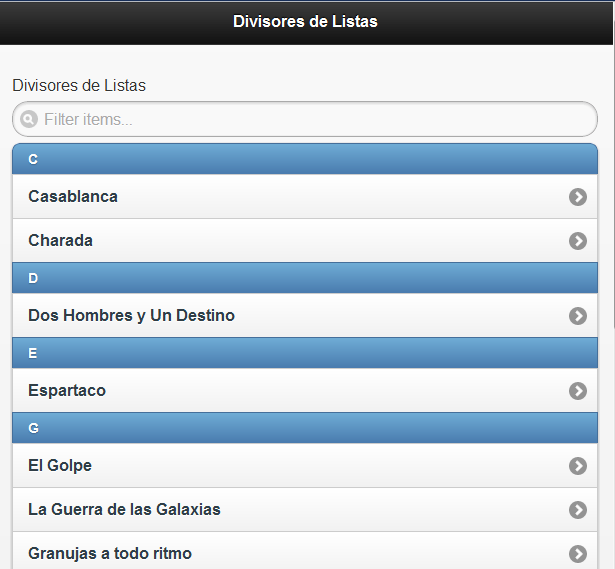

En el ejemplo [Listas de Elementos en jQuery Mobile](http://lineadecodigo.com/desarrollo-movil/listas-de-elementos-en-jquery-mobile/) veíamos como construir una lista de elementos para un dispositivo móvil utilizando [jQuery Mobile](https://lineadecodigo.com/jquery/mobile/). Ahora vamos a ir un paso más allá y vamos a ver como añadir elementos divisores en las listas. Es decir, items que nos permitan separar elementos para su organización. Puede ser una agrupación alfabética, geográfica, horaria,... En nuestro caso vamos crear una lista de películas cuyos divisores sean alfabéticos.


## Cargar el Framework


Lo primero que hacemos es cargar el framework jQuery Mobile:


```html
<link href="jquery.mobile-1.1.0.min.css" rel="stylesheet"></link>
<script src="jquery-1.7.1.min.js"></script>
<script src="jquery.mobile-1.1.0.min.js"></script>
```


## Crear la Lista Básica


Como vimos en el ejemplo [Listas de Elementos en jQuery Mobile](http://lineadecodigo.com/desarrollo-movil/listas-de-elementos-en-jquery-mobile/) utilizamos un elemento UL con un atributo `data-role="listview"`:


```html
<ul data-role="listview" data-inset="true" data-filter="true">
  <li>Casablanca</li>
  <li>Charada</li>
  <li>Dos Hombres y Un Destino</li>
  <li>Espartaco</li>
  <li>El Golpe</li>
  <li>La Guerra de las Galaxias</li>
  <li>Granujas a todo ritmo</li>
</ul>
```


Además hemos añadido los atributos `data-inset="true"` y `data-filter="true"` para que la lista salga enmarcada y para tener un filtro en la lista, respectivamente.


## Añadir los Divisores


Ahora meteremos los divisores de listas. Los divisores de listas serán otros elementos LI. Si bien estos elementos para ser diferenciados del resto de elementos de la lista tendrán un atributo `data-role="list-divider"`. Quedándonos nuestro código [jQuery Mobile](https://www.manualweb.net/jquery/) de la siguiente forma:


```html
<ul data-role="listview" data-inset="true" data-filter="true">
  <li data-role="list-divider">C</li>
  <li>Casablanca</li>
  <li>Charada</li>
  <li data-role="list-divider">D</li>
  <li>Dos Hombres y Un Destino</li>
  <li data-role="list-divider">E</li>
  <li>Espartaco</li>
  <li data-role="list-divider">G</li>
  <li>El Golpe</li>
  <li>La Guerra de las Galaxias</li>
  <li>Granujas a todo ritmo</li>
</ul>
```


El nombre del item que utiliza el atributo `data-role="list-divider"` será el nombre que se utilice como elemento divisor. El efecto conseguido con [jQuery Mobile](https://www.manualweb.net/jquery/) para crear divisores de lista será algo parecido a:




