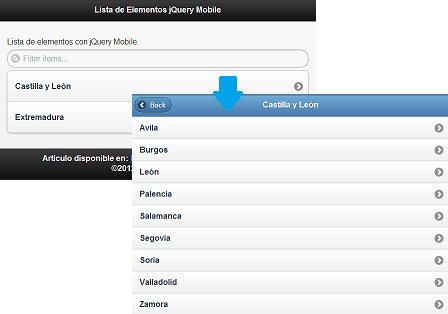

Ya vimos como hacer una lista simple de elementos y algunos atributos data para modificar esta lista con [jQuery Mobile](https://www.manualweb.net/jquery/). En este caso vamos a ver como podemos crear listas anidadas. Es decir una lista que, cuando seleccionemos una opción, nos muestre subopciones de dicha opción.


Algo claro si pensamos en ciudades/regiones/países. En nuestro caso vamos a utilizar ciudades y comunidades autónomas de España.





## Crear Listas Anidadas


Para crear listas anidadas con [jQuery Mobile](https://www.manualweb.net/jquery/) solo tenemos que seguir la implementación que haríamos directamente en [HTML](https://www.manualweb.net/html/). Ya que será el formateador de [jQuery Mobile](https://www.manualweb.net/jquery/) quien se encargue de realizar la anidación de la lista.


Así el código quedaría de la siguiente forma:


```html
<ul data-role="listview">
  <li>
    <h3>Castilla y León</h3>
    <ul>
      <li><a href="#">Ávila</a></li>
      <li><a href="#">Burgos</a></li>
      <li><a href="#">León</a></li>
      <li><a href="#">Palencia</a></li>
      <li><a href="#">Salamanca</a></li>
      <li><a href="#">Segovia</a></li>
      <li><a href="#">Soria</a></li>
      <li><a href="#">Valladolid</a></li>
      <li><a href="#">Zamora</a></li>
    </ul>
  </li>
  <li>
    <h3>Madrid</h3>
    <ul>
      <li><a href="#">Madrid</a></li>
    </ul>
  </li>
</ul>
```


Un punto importante para el formato que utiliza [jQuery Mobile](https://www.manualweb.net/jquery/) es que el elemento de la lista superior lo maquetemos mediante un elemento H3. Este simple código nos ayuda a tener listas anidadas con [jQuery Mobile](https://www.manualweb.net/jquery/).


## Añadir Botón de Retroceso


Pero podemos añadir alguna cosa y es que al entrar en la lista anidada perdemos la referencia a la lista padre. Y es por ello que vamos a insertar un elemento back en la cabecera de la lista anidada.


Para esto nos vamos a apoyar en el API de [jQuery Mobile](https://www.manualweb.net/jquery/) y en concreto en el atributo **$.**[**mobile.page**](http://mobile.page/)**.prototype.options.addBackBtn**. Y es que inicializando este atributo a true nos aparecerá el botón de back al entrar en la anidación de las listas.


Para configurarlo deberemos de hacerlo al arrancar el framework jQuery. Es en este momento cuando se lanza el evento mobileinit. Por lo cual nos vamos a suscribir a este evento mediante un método .bind() para realizar la inicialización.


```javascript
$(document).bind("mobileinit", function(){
    $.mobile.page.prototype.options.addBackBtn = true;
});
```


Y ya tenemos el ejemplo de las listas anidadas con [jQuery Mobile](https://www.manualweb.net/jquery/) montado. Eso sí, una de las cosas que veremos es que se pierden las cabeceras header y footer de la lista inicial. ¿Alguien sabe como resolverlo?

