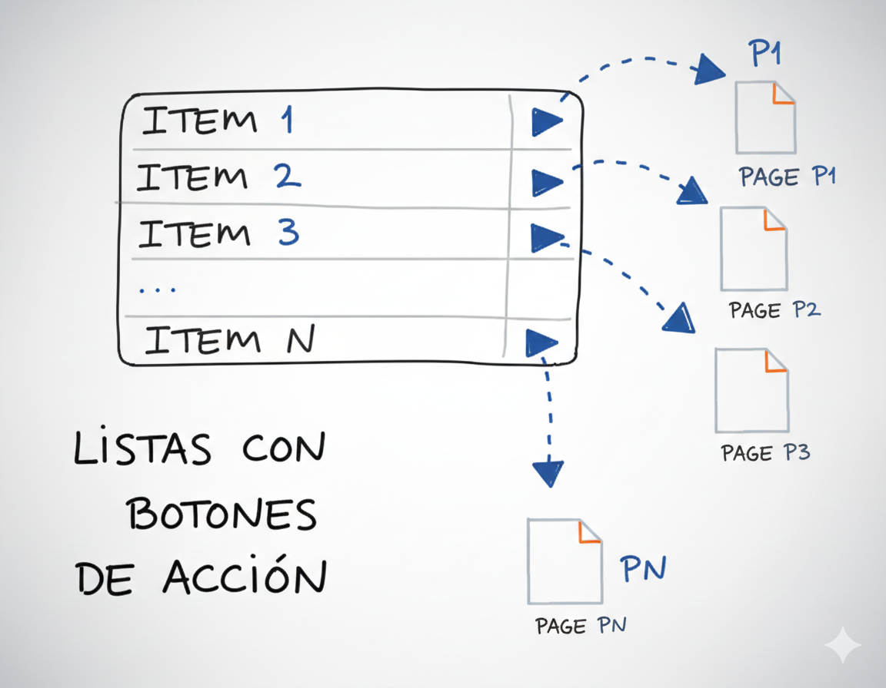

Cuando creamos una lista con [jQuery Mobile](https://www.manualweb.net/jquery/), normalmente su uso será el de tener un conjunto de enlaces sobre los que podremos ejecutar la acción de navegar. Pero puede darse el caso que necesitemos que cada uno de los items de la lista tenga más de un comportamiento. Es decir que, además de poder navegar mediante los items, podamos añadir botones para ejecutar una segunda acción sobre el elemento.





## Crear la Lista Básica


Lo primero que haremos será crear una lista básica tal y como vimos en [Listas de Elementos con jQuery Mobile](http://lineadecodigo.com/desarrollo-movil/listas-de-elementos-en-jquery-mobile/).


```html
<ul data-role="listview">
  <li><a href="#">Espartaco</a></li>
  <li><a href="#">La Naranja Mecánica</a></li>
  <li><a href="#">El Padrino</a></li>
  <li><a href="#">Sin Perdón</a></li>
  <li><a href="#">Dos Hombres y Un Destino</a></li>
  <li><a href="#">El Golpe</a></li>
  <li><a href="#">La Guerra de las Galaxias</a></li>
  <li><a href="#">Casablanca</a></li>
  <li><a href="#">Spy Game</a></li>
  <li><a href="#">Pulp Fiction</a></li>
</ul>
```


## Añadir el Botón de Acción


Ahora, para insertar el botón de acción en cada uno de los items lo que tenemos que hacer es insertar un nuevo enlace anexo al contenido de cada uno de los [elementos LI](https://www.w3api.com/HTML/li/).


```html
<li><a href="#">La Naranja Mecánica</a><a href="#">Favorita</a></li>
```


En este enlace podremos elegir el tipo de botón mediante el atributo **data-icon**. Los valores que podemos poner al botón son:

- **Flecha a izquierda**, arrow-l
- **Flecha a derecha**, arrow-r
- **Flecha hacia arriba**, arrow-u
- **Flecha hacía abajo**, arrow-d
- **Borrar**, delete
- **Más**, plus
- **Menos**, minus
- **Check**, check
- **Motor (o engine)**, gear
- **Actualizar**, refresh
- **Reenviar**, forward
- **Volver**, back
- **Grid**, grid
- **Estrella**, star
- **Alerta**, alert
- **Info**, info
- **Home**, home
- **Buscar**, search

De esta manera, para poner una estrella como botón de acción escribiremos:


```html
<li><a href="#">La Naranja Mecánica</a><a href="#" data-icon="star">Favorita</a></li>
```


## Personalizar el Tema del Botón


Otra cosa que podemos personalizar del botón es el tema del botón. Es decir, el juego de colores con los que se representará. Cada botón puede tener su propio tema. Para poner un tema u otro utilizamos el atributo **data-theme**. Y los valores a asignar son 'a', 'b' o 'c'.


```html
<li><a href="#">El Padrino</a><a href="#" data-icon="star" data-theme="c">Favorita</a></li>
```


## Código Completo


El código final de [jQuery Mobile](https://www.manualweb.net/jquery/) para crear listas con botones de acción quedaría de la siguiente forma:


```html
<ul data-role="listview">
  <li><a href="#">Espartaco</a><a href="#" data-icon="star" data-theme="c">Favorita</a></li>
  <li><a href="#">La Naranja Mecánica</a><a href="#" data-icon="star" data-theme="c">Favorita</a></li>
  <li><a href="#">El Padrino</a><a href="#" data-icon="star" data-theme="c">Favorita</a></li>
  <li><a href="#">Sin Perdón</a><a href="#" data-icon="star" data-theme="c">Favorita</a></li>
  <li><a href="#">Dos Hombres y Un Destino</a><a href="#" data-icon="star" data-theme="c">Favorita</a></li>
  <li><a href="#">El Golpe</a><a href="#" data-icon="star" data-theme="c">Favorita</a></li>
  <li><a href="#">La Guerra de las Galaxias</a><a href="#" data-icon="star" data-theme="c">Favorita</a></li>
  <li><a href="#">Casablanca</a><a href="#" data-icon="star" data-theme="c">Favorita</a></li>
  <li><a href="#">Spy Game</a><a href="#" data-icon="star" data-theme="c">Favorita</a></li>
  <li><a href="#">Pulp Fiction</a><a href="#" data-icon="star" data-theme="c">Favorita</a></li>
</ul>
```

