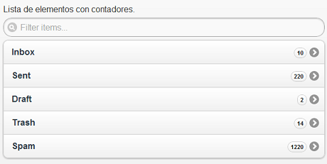

Siguiendo con los ejemplos de listas en [jQuery Mobile](https://www.manualweb.net/jquery/) ahora vamos a ver como podemos añadir un contador a un elemento. Supongo que el ejemplo más visual para explicarlo es el de un buzón de correo electrónico, en el cual, por cada carpeta vemos los elementos no leídos.





Como se puede ver en la imagen tenemos una lista de elementos con contadores. Así que vamos a ver como podemos llevar esto a cabo con [jQuery Mobile](https://www.manualweb.net/jquery/).


## Crear la Lista Base


Lo primero será crearnos la lista de los elementos con [jQuery Mobile](https://www.manualweb.net/jquery/):


```html
<ul id="mylistview" data-role="listview">
  <li><a href="#">Inbox</a></li>
  <li><a href="#">Sent</a></li>
  <li><a href="#">Draft</a></li>
  <li><a href="#">Trash</a></li>
  <li><a href="#">Spam</a></li>
</ul>
```


El atributo que utilizamos para crear la lista de elementos en [jQuery Mobile](https://www.manualweb.net/jquery/) es **data-role="listview"**.


## Añadir los Contadores


Para poder añadir los contadores a los elementos [jQuery Mobile](https://www.manualweb.net/jquery/) no podría faltar a su filosofía de lenguaje de etiquetas y utiliza una clase para poder añadir los contadores. La clase en cuestión es **"ui-li-count"**.


Es por ello que solo tendremos que añadir un elemento span con el valor del contador, el cual referencia mediante un atributo class a dicha clase.


```html
<ul id="mylistview" data-role="listview">
  <li><a href="#">Inbox<span class="ui-li-count">10</span></a></li>
  <li><a href="#">Sent<span class="ui-li-count">220</span></a></li>
  <li><a href="#">Draft<span class="ui-li-count">2</span></a></li>
  <li><a href="#">Trash<span class="ui-li-count">14</span></a></li>
  <li><a href="#">Spam<span class="ui-li-count">1220</span></a></li>
</ul>
```


Y ya tenemos nuestra lista de elementos con contadores en [jQuery Mobile](https://www.manualweb.net/jquery/).

