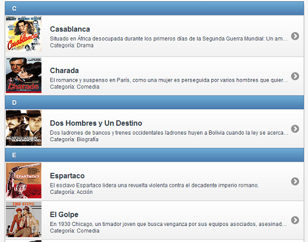

Las listas de elementos que desarrollemos para nuestros dispositivos móviles con [jQuery Mobile](https://www.manualweb.net/jquery/) no solo tiene por qué estar compuestas de texto, si no que también pueden contener imágenes dentro de la lista. Imaginemos una lista de películas dónde cada una de las películas lleva la caratula de dicha película.





## Crear la Lista Base


Lo primero que tenemos que hacer es crear la lista de elementos mediante el **atributo data-role="listview"**.


```html
<ul id="mylistview" data-role="listview" data-inset="true" data-autodividers="true" data-filter="true" data-filter-placeholder="Qué película buscas?">			
  <li><a href="#"><h3>Casablanca</h3></a></li>
  <li><a href="#"><h3>Charada</h3></a></li>			
  <li><a href="#"><h3>Dos Hombres y Un Destino</h3></a></li>			
</ul>
```


Vemos que hemos utilizado un elemento H3 para dar mayor relevancia al contenido del elemento de la lista. Ya que luego seguiremos añadiendo información a dicho elemento y el título será lo más representativo.


## Añadir las Imágenes


Ahora para meter la imagen simplemente tendremos que utilizar un elemento IMG de [HTML](https://www.manualweb.net/html/). Pondremos el elemento IMG antes del contenido del título:


```html
<ul id="mylistview" data-role="listview" data-inset="true" data-autodividers="true" data-filter="true" data-filter-placeholder="Qué película buscas?">			
  <li><a href="#"><h3>Casablanca</h3></a></li>
  <li><a href="#"><h3>Charada</h3></a></li>			
  <li><a href="#"><h3>Dos Hombres y Un Destino</h3></a></li>
</ul>
```


## Añadir Información Adicional


Ya tenemos las imágenes puestas dentro de nuestra lista de elementos en [jQuery Mobile](https://www.manualweb.net/jquery/). Ahora ya solo nos queda meter mas información a los elementos. Eso, sí, solo si queremos. 


Al final el código [jQuery Mobile](https://www.manualweb.net/jquery/) nos quedará de la siguiente forma:


```html
<ul id="mylistview" data-role="listview" data-inset="true" data-autodividers="true" data-filter="true" data-filter-placeholder="Qué película buscas?">			
  <li><a href="#"><h3>Casablanca</h3><p>Situado en África desocupada durante... <br>Categoría: Drama</p></a></li>
  <li><a href="#"><h3>Charada</h3><p>El romance y suspenso en París, como una mujer... <br>Categoría: Comedia</p></a></li>			
  <li><a href="#"><h3>Dos Hombres y Un Destino</h3><p>Dos ladrones de bancos y trenes occidentales ladrones huyen a Bolivia ...<br>Categoría: Biografía</p></a></li>
</ul>
```

