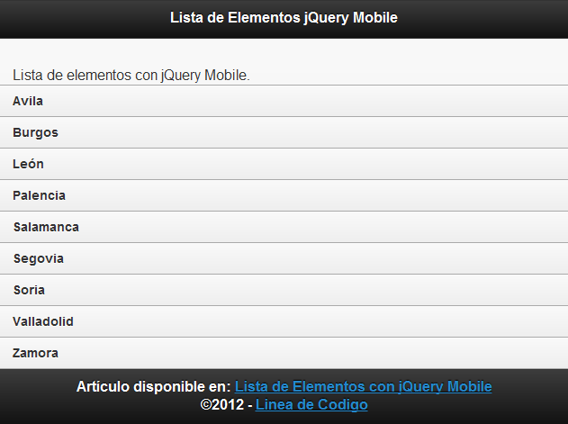
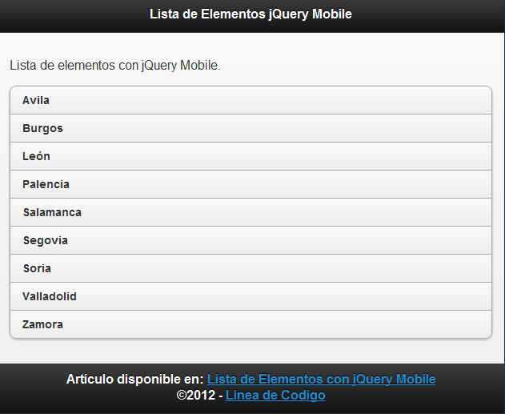
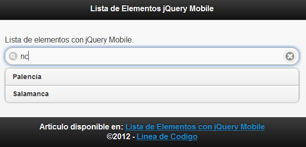

[jQuery Mobile](https://www.manualweb.net/jquery/) nos ofrece una forma sencilla de adaptar nuestras listas a los dispositivos móviles. Y es que una lista de elementos para el diseño móvil se sigue maquetando con los elementos [UL](https://www.w3api.com/HTML/ul/) y [LI](https://www.w3api.com/HTML/li/).


## Lista HTML Básica


Podríamos tener una lista tal y como esta:


```html
<ul>
  <li>Avila</li>
  <li>Burgos</li>
  <li>León</li>
  <li>Palencia</li>
  <li>Salamanca</li>
  <li>Segovia</li>
  <li>Soria</li>
  <li>Valladolid</li>
  <li>Zamora</li>
</ul>
```


## Atributo data-role


Si bien [jQuery Mobile](https://www.manualweb.net/jquery/) nos proporciona una serie de características para maquetarla. La primera es la que le da la apariencia. Esta la conseguimos con un atributo data-role. En este caso con **data-role="listview"**. Este atributo lo añadimos al elemento UL.


```html
<ul data-role="listview">
  <li>Avila</li>
  <li>Burgos</li>
  <li>León</li>
  <li>Palencia</li>
  <li>Salamanca</li>
  <li>Segovia</li>
  <li>Soria</li>
  <li>Valladolid</li>
  <li>Zamora</li>
</ul>
```


Y conseguiremos el siguiente efecto de maquetación.





## Atributo data-inset


Lo que podemos apreciar en la imagen es que la lista no se diferencia de forma correcta del contenido de la página. Si queremos que la lista se diferencia del resto del contenido podemos añadirla un recuadro. Esto nos lo posibilita el atributo **data-inset="true"**.


```html
<ul data-role="listview" data-inset="true">
  <li>Avila</li>
  <li>Burgos</li>
  <li>León</li>
  <li>Palencia</li>
  <li>Salamanca</li>
  <li>Segovia</li>
  <li>Soria</li>
  <li>Valladolid</li>
  <li>Zamora</li>
</ul>
```





## Atributo data-filter


Por último podemos añadirle un filtro a nuestra lista. Y es que esto lo conseguimos de una forma sencilla con el atributo **data-filter="true"**. No solo añadiremos un filtro, si no que el filtro realiza el filtrado del contenido de la lista.


```html
<ul data-role="listview" data-inset="true" data-filter="true">
  <li>Avila</li>
  <li>Burgos</li>
  <li>León</li>
  <li>Palencia</li>
  <li>Salamanca</li>
  <li>Segovia</li>
  <li>Soria</li>
  <li>Valladolid</li>
  <li>Zamora</li>
</ul>
```





El código final de nuestra lista de elementos en [jQuery Mobile](https://www.manualweb.net/jquery/) quedaría de la siguiente forma, combinando todos los atributos para conseguir una lista con apariencia móvil, diferenciada del contenido y con capacidad de filtrado.

