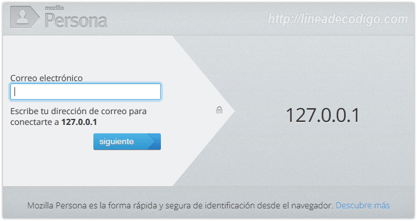

Como muchos sabréis _Mozilla_ lleva ya bastante tiempo desarrollando _Mozilla Persona_ (Antes llamado BrowserID) para ser uno de los estándares en identificación centralizada y dar una alternativas a los actuales sistemas.


¿Pero que tiene de diferente _Mozilla Persona_ de _OpenID_ o _Facebook Connect_?

- La primera diferencia significativa es que _Mozilla_ no filtra información a terceros.
- Es mucho más sencillo para el usuario a la hora de registrarse.
- Facilidades al desarrollador, con una comunidad entera de personas que colaboran entre si para facilitar la documentación.




A mi personalmente me parece un gran avance a la hora de intentar unificar Internet, y mas de una empresa como _Mozilla_ (si lo reconozco soy algo _mitómano_), ademas de que respeta todos los estándares, utiliza un diseño bastante minimalista y queda bien en todos los sitios web.


Bien después de esta pseudo presentación, vamos a ver como podemos conectarnos desde [PHP5](http://www.manualweb.net/php/) a los servidores de _Mozilla_ para verificar las sesiones, también tocaremos algo de _front-end_ para explicar la fachada.


## Conectando con Mozilla Personas


Vamos a empezar hablando del _back-end_ que debemos utilizar en nuestro servidor, para el ejemplo que voy a dar es necesario una versión de [PHP](http://www.manualweb.net/php/) igual o superior a la 5, tener activado el modulo [Open SSL](http://php.net/manual/es/book.openssl.php), tener activado [fopen](http://php.net/manual/es/function.fopen.php).


En primer lugar vamos a crear una clase que nos realice todas las gestiones de la conexión con Mozilla Personas. Esta clase la llamaremos class.mozilla.php. Dentro de ella encapsularemos los métodos necesarios para conectarnos a Mozilla Personas y para que podamos instanciarla desde varios sitios.


En primer lugar definiremos una constante con el servidor de Mozilla Personas que realiza las validaciones:


```php
const REMOTE_URL = 'https://login.persona.org/verify'';
```


El primer método será build_query. Este método será el que construya la query que le vamos a enviar a Mozilla Personas.


```php
private function build_query(){
  //Creamos un array con la solicitud recibida por el cliente y la direccion url de nuestro dominio.
  $httpArray = array( 'assertion' => $this->_assertion, 
    'audience'  => urlencode($this->_localURL));
                                
  //Codificamos los datos en formato URL
  $data = http_build_query($httpArray);
            
  // Creamos la peticion y las cabezeras HTTP.
  $this->_QueryHTTP = array('http' => array( 'method'  => 'POST',
    'content' => $data,
    'header'  => "Content-type: application/x-www-form-urlencoded\r\n"
      . "Content-Length: " . strlen($data) . "\r\n")
  );                                                                          
}
```


El conjunto de datos que enviamos estará compuesto por el assertion, que nos llega desde el cliente, y por la URL sobre la que queremos realizar la validación.


Lo siguiente será realizar el envío de estos datos al servidor de Mozilla Personas. Para ello nos vamos a apoyar en la clase fopen.


```php
public function set_http_request(){
        	        
  //Creamos el flujo de texto que sera enviado a Mozilla desde la propiedad _QueryHTTP.
  $ctx = stream_context_create($this->_QueryHTTP);
            
  //Creamos la conexión con mozilla y enviamos el contexto de la petición.
  $fp = fopen(self::REMOTE_URL, 'rb', false, $ctx);
            
  //Si la conexión fue correcta.
  if ($fp) {            
    //Leemos el contenido de la respuesta.
    $result = stream_get_contents($fp);
                
    //Asignamos a la propiedad _RequestJSON la respuesta descodificada en Json.
    $this->_RequestJSON = json_decode($result);
                
    return true;
  }
}
```


Si la validación es correcta Mozilla Personas nos devolverá algo del estilo:


```json
{
    "status": "okay",
    "email": "correod@lineadeocodigo.com",
    "audience": "https://lineadecodigo.com",
    "expires": 1308859352261,
    "issuer": "browserid.org"
}
```


Nosotros nos los guardamos para poder acceder al contenido del resultado. Sobre todo a los campos _status_ y _email_.


## Proceso de login


En el proceso de login lo que haremos será interactuar con los métodos de nuestra clase class.mozilla.php. Para ello lo primero que haremos será incluirla e instanciarla.


```php
//Requerimos de la clase ya antes expuesta
require_once('class.mozilla.php');

//Creamos el objecto con el valor que se recibe desde el POST y nuestro Dominio
$objMozilla = new Mozilla_Persona($_POST['assertion'], 'lineadecodigo.com');
```


Como podéis ver le pasamos el nombre del servidor sobre el que queremos crear la validación.


Lo siguiente será realizar el envío de datos con el método que creamos anteriormente, set_http_request, y validar si se ha producido el login de forma correcta. Si es así accedemos al email, guardandolo en la sesión y devolvemos mediante JSON los datos el estado y la acción de new. Esta acción nos servirá para refrescar la página.


```php
//Comprobamos que la conexión se haya efectuado correctamente
if($objMozilla->set_http_request()){
    //Comprobamos si la identificación fue correta
    if($objMozilla->get_is_login()) {
        //Asignamos el correo a la variable de session
        $_SESSION['email'] = $objMozilla->get_email();

        //Se imprime que todo fue correcto en formato Json
        echo json_encode(array("status" => "okay", "action" => 'new'));
    }
}
```


## Front-end de nuestra aplicación


Ahora pasaremos a el _front-end_, es necesario JQuery y la librería _include.js_ de _Mozilla Persona_. El uso de la librería _include.js_ es primordial ya que es la que tiene toda la parte visual de la autentificación de Mozilla Personas.


Para ello tendremos que llamar al método [navigator.id](http://navigator.id/).get.


```javascript
$(document).ready(function(){
  $('#browserid').click(function() {  
    navigator.id.get(gotAssertion, {allowPersistent: true});  
    return false;  
  });   
})
```


Este método espera una función que realizará comunicación AJAX vía JSON con nuestro proceso de login.


```javascript
function gotAssertion(assertion) {  
  if (assertion !== null) {  
    $.ajax({  
    type: 'POST',  
    url: 'login.php',  
    data: { assertion: assertion, browserid: true },  
    success: function(res, status, xhr) {  
      if (res !== null) {
        var oJson = jQuery.parseJSON(res);
            
        if(oJson.status == 'okay'){
          //Si todo es correcto la pagina se refresca.
          if(oJson.action == 'new') location.reload(true);
        } else {
          alert("Error");  
        }
      } 
    },  
    error: function(res, status, xhr) {  
      alert("Error de conexion");  
    }});  
  }  
}
```


Como podéis ver son unos ejemplos muy sencillos y muy fáciles para el programador, si os interesa mucho mas el tema podéis ir a la pagina para desarrolladores que tiene _Mozilla_ [aquí](http://www.mozilla.org/en-US/persona/developer-faq/).


Espero que os animéis a probarlos en vuestros sistemas web y también a contribuir por un Internet mas limpio y seguro.

