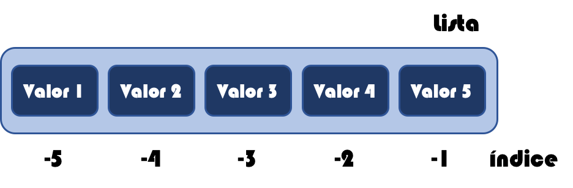

En el artículo de hoy vamos a ver lo sencillo que es **rotar listas con slicing en Python**. Es decir, vamos a mover n elementos hacia izquierda o hacia derecha. De esta manera la idea es que si rotar hacia la derecha los elementos que vayan saliendo por la derecha vayan entrando por la izquierda y si estamos rotando a la izquierda, los elementos que salgan por la izquierda deberán de ir entrando por la derecha.


## Definir una lista


Pero lo primero de todo será el definir nuestra lista. Así que tal y como hemos visto en otros ejemplos de manejo de listas en Python creamos una sencilla lista de números:


```python
lista = [1, 2, 3, 4, 5, 6, 7, 8, 9, 10]
```


## Slicing en Python


Y ahora pasamos a rotar los números. En este caso hemos dicho que lo vamos a hacer con slicing. Así que lo primero será saber **qué es el slicing en Python**.


Cuando tenemos una lista los elementos se numeran del 0 al N, donde N es el tamaño de la lista -1. Veamos gráficamente cómo serían los índices.


De igual manera los índices se pueden identificar con valores negativos de derecha a izquierda. Siendo el último elemento de la lista el índice -1 hasta el primer elemento que tendría de índice el tamaño de la lista en negativo. Vemos visualmente cómo quedaría.





La técnica de slicing lo que hace es extraer un conjunto de elementos de la lista indicando su índice de origen y su índice de destino más 1, separados por dos puntos. La sintaxis sería la siguiente:


```python
lista[inicio:fin]
```


Estos índices pueden ser los positivos y los negativos. De esta manera si queremos desde el valor 2 hasta el valor 4 podríamos escribir la siguiente notación de slicing con Python.


```python
lista[2:5]
```


Además tenemos que saber que si a la hora de hacer el slicing en Python no indicamos el primer índice se asume que es el primero de la lista y si no incluye el último se asume que es el final de la lista. De esta manera podríamos obtener elementos de la siguiente forma:


```python
lista[:3]   # Desde el inicio hasta el índice 3
lista[5:]   # Desde el índice 5 hasta el final
```


## Concatenar listas


Por otro lado podemos concatenar las listas con el operador `+` siguiente la siguiente sintaxis:


```python
lista1 + lista2
```


## Rotar listas hacia la izquierda


Con todos estos conocimientos vamos a ver cómo podemos rotar listas con slicing en Python hacia la derecha y hacia la izquierda. Si queremos rotarla hacia la izquierda, por ejemplo 3 elementos escribiremos lo siguiente:


```python
lista[3:] + lista[:3]
```


Componemos la lista desde el índice 3 hasta el final más la lista desde el inicio al 3.


## Rotar listas hacia la derecha


En el caso de querer rotarla hacia la derecha vamos a utilizar los índices negativos. De esta forma si queremos rotar 6 elementos hacia la derecha


```python
lista[-6:] + lista[:-6]
```


Vemos que lo componemos desde el índice -6 hasta el final más desde el inicio hasta el -6.


Así de sencillo hemos conseguido rotar listas con slicing en Python hacia la derecha e izquierda. Espero que os sea de utilidad.

