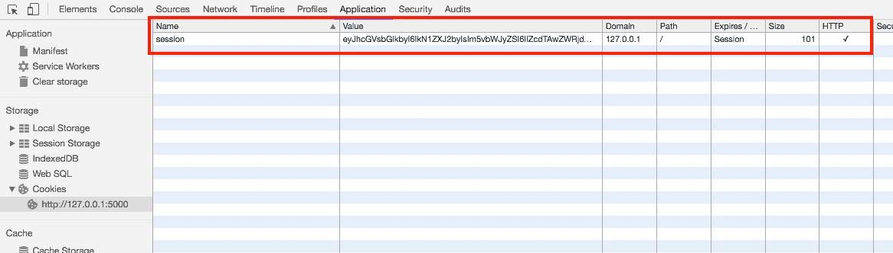

Hoy vamos a ver cómo podemos manejar una sesión en Flask para poder almacenar información entre cada una de las peticiones que hagamos sobre nuestra aplicación.


## Objeto Flask Session


Lo primero que tenemos que saber es que el objeto que gestiona la sesión en Flask es `session`. Por lo tanto lo primero que tenemos que hacer es importar dicho objeto de Flask.


```python
from flask import Flask, session
```


## Objeto Flask Session y las cookies


Es importante saber cómo Flask gestiona las sesiones, ya que no utiliza un espacio de memoria entre cada una de las peticiones, aunque podríamos llegar a extenderlo e implementarlo, si no que lo que hace, por defecto, es **crear una cookie con el contenido de la sesión**.


Para poder crear la cookie y cifrar su contenido necesita una clave secreta. Definiremos la clave secreta de la siguiente forma:


```python
app.secret_key = 'mi_clave_secreta'
```


Cómo podemos apreciar en el navegador aparece la cookie con los datos de la sesión cifrados.





## Acceso a Flask Session


Ahora vamos a añadir contenido a la sesión. Por ejemplo, en un primer método vamos a pintar un formulario que pida los datos al usuario y estos los guarde en memoria.


```python
@app.route('/formulario')
def formulario():
    return render_template('formulario.html')

@app.route('/guardar', methods=['POST'])
def guardar():
    session['nombre'] = request.form['nombre']
    session['email'] = request.form['email']
    return redirect(url_for('mostrar'))
```


Vemos que utilizamos la siguiente estructura para guardar datos en sesión:


```python
session['clave'] = valor
```


Lo siguiente será consultar esta información de la sesión de Flask y utilizar su contenido. A tal respecto hemos creado un método que pinta esta información.


```python
@app.route('/mostrar')
def mostrar():
    nombre = session['nombre']
    email = session['email']
    return render_template('mostrar.html', nombre=nombre, email=email)
```


Vemos que utilizamos la misma estructura que antes, pero sin asignación, para poder mostrar el contenido:


```python
variable = session['clave']
```


Es interesante también validar que la variable existe en sesión, antes de acceder a ella. Es por ello que hemos utilizado la estructura `in` para realizar esta validación:


```python
if 'nombre' in session:
    nombre = session['nombre']
```


De esta forma ya hemos visto cómo podemos manejar la sesión en Flask.

