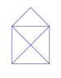

Mediante este ejemplo intentamos explicar el uso de las polilineas en SVG. Una polilinea no deja de ser la línea que se traza entre una consecución de puntos. La principal diferencia con el polígono es que, en el caso del polígono, indicamos los vértices y automáticamente se traza una línea desde el último punto al primero.


Para explicar este ejemplo había pensado en un reto artístico muy simple. Este reto consiste en dibujar una especie de casa con una cruz en su parte inferior (en el cuadrado) sin pasar dos veces por la misma línea. Consiguiendo al final un dibujo como el que se presenta:





Básicamente, su solución se basa en un conjunto de puntos, siempre y cuando no tengamos el mismo par de puntos consecutivos.


Puestos en SVG lo primero que tenemos que hacer es definir nuestro documento SVG. Para ello nos bastará con definir la etiqueta SVG de la siguiente forma:


```xml
<?xml version="1.0"?>
<svg xmlns=”http://www.w3.org/2000/svg”>
</svg>
```


Como vemos el documento empieza con una declaración de documento XML y es que los documentos SVG no dejan de ser documentos XML.


Para poder realizar el trazado de nuestro dibujo utilizaremos la etiqueta polyline. En esta etiqueta lo único que hay que identificar es, mediante el atributo points, la lista de puntos por donde queremos que se trace la línea. Quedándonos el siguiente código:


```xml
<polyline
  points="200,200 200,100 250,50 300,100 300,200
          200,100 300,100 200,200 300,200"
/>
```


Para el color y grosor de las líneas nos ayudamos de los atributos stroke (para el color) y stroke width (para el grosor). Esto se repite para todo el resto de figuras básicas: line, circle,...


Quedándonos la siguiente linea de código:


```xml
<polyline
  fill="white"
  stroke="blue"
  stroke-width="1"
  points="200,200 200,100 250,50 300,100 300,200
          200,100 300,100 200,200 300,200"
/>
```

